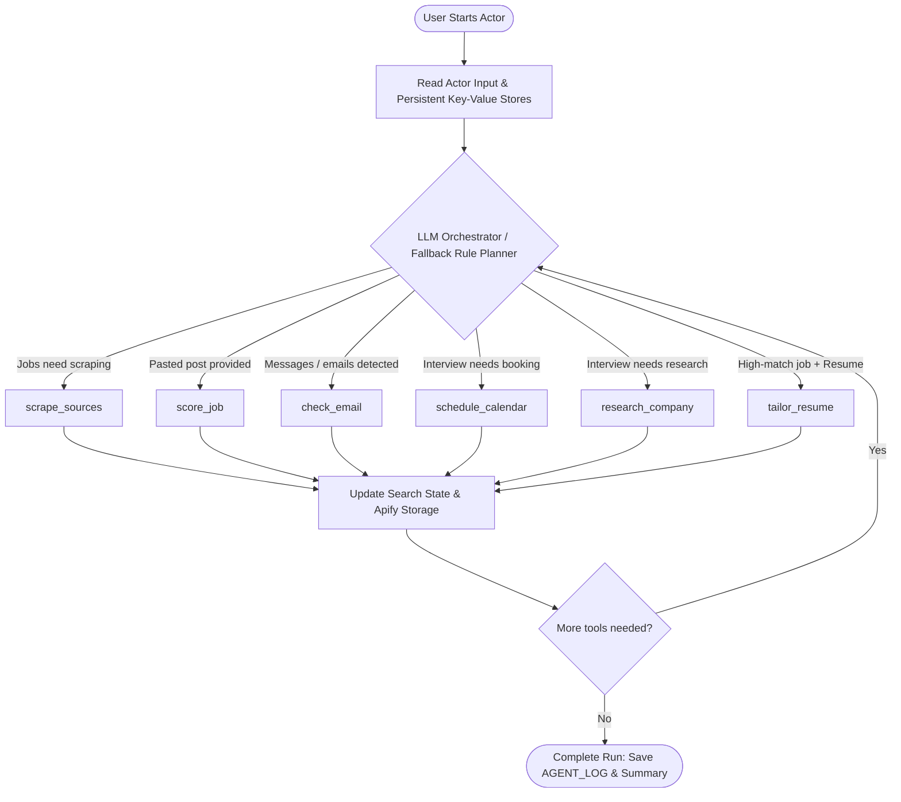

# 🛡️ GigRadar — AI Job-Search Agent for Nigeria

[](https://apify.com)
[](https://apify.com)
[](https://apify.com)
[](https://nodejs.org)
[](https://en.wikipedia.org/wiki/Nigeria)
[](./gigradar/package.json)

> **GigRadar isn't a job scraper. It's an autonomous AI agent that decides what your job search needs next.**

Every day, thousands of Nigerians scroll WhatsApp groups, Telegram channels, and job boards hunting for real opportunities — while dodging scam postings asking for "registration fees," and applying to "remote" roles that quietly exclude anyone outside the US. GigRadar sits in that mess and does the thinking for you: it checks if a job is safe, tells you if you can actually get it, tracks every application so nothing slips through ghosting, preps you for interviews, and tailors your resume — without ever inventing experience you don't have.

---

## 📑 Table of Contents

- [🎯 The Problem](#-the-problem)
- [🧠 How It Works](#-how-it-works)
- [⚙️ Built on Apify — Not Bolted On](#️-built-on-apify--not-bolted-on)
- [📊 Architectural Flow](#-architectural-flow)
- [🛠️ Agent Tooling System](#️-agent-tooling-system)
- [💸 Pay Per Event Pricing](#-how-much-does-it-cost)
- [🚀 How to Use It](#-how-to-use-it)
- [📥 Input Schema & Options](#-input-schema--options)
- [📤 Structured Output & Storage](#-structured-output--storage)
  - [Dataset Records](#dataset-records)
  - [Key-Value Store Artifacts](#key-value-store-artifacts)
- [💻 Integration & API Usage](#-integration--api-usage)
- [🔑 Setup for AI and Google Features](#-setup-for-ai-and-google-features-optional)
- [❓ FAQ & Safety Disclaimers](#-faq)
- [🌍 Why This Matters](#-why-this-matters)

---

## 🎯 The Problem

- **Scams are rampant on informal job channels.** Upfront fees, BVN requests, WhatsApp-only "recruiters" — these prey on job seekers with the least room to lose money.
- **"Remote" often isn't remote for Nigerians.** Visa, country-of-residence, and payment gateway restrictions silently block qualified applicants, and most job seekers only find out after wasting hours applying.
- **Job searching is heavily fragmented.** Finding, verifying, tracking, scheduling, preparing, and tailoring are five different jobs most people juggle manually across five different apps.

GigRadar collapses all five into **one autonomous agent**.

---

## 🧠 How It Works

An **LLM orchestrator** inspects the current state of your job search — jobs found, open applications, pending interviews without calendar entries or briefs, and whether you've provided a resume — and **decides which tool to call next**, with what arguments, until nothing more is worth doing.



### Dual-Engine Resilience

Every decision is logged to the `AGENT_LOG` key-value record, providing complete visibility into what the agent chose and why. If the configured LLM provider experiences outages or rate limits, a **deterministic rule-based planner** seamlessly takes over from the exact same state — **a run never just fails**.

---

## 🛠️ Agent Tooling System

| Tool | What It Does | Why It Matters |
|---|---|---|
| `scrape_sources` | Dynamically picks job-board categories and city pages based on your role, crawls [Jobberman](https://www.jobberman.com) and [MyJobMag](https://www.myjobmag.com), scores and filters every listing. | Discovers active, genuine Nigerian roles without manual page-by-page browsing. |
| `score_job` | Evaluates job posts you paste in from WhatsApp groups, Telegram channels, flyers, or SMS. | Exposes "interview registration fee" scams and BVN phishing before you respond. |
| `check_email` | Reads pasted messages (or Gmail via OAuth), extracts status updates, and catches ghosting. | Flags rescheduling vs rejections and reminds you when recruiters go silent. |
| `schedule_calendar` | Generates Google Calendar events with pre-interview alerts or outputs universal `.ics` calendar files. | Ensures you never miss an interview, regardless of device or timezone confusion. |
| `research_company` | Crawls the employer's official website and synthesizes an interview-prep brief. | Equips you with company background, products, leadership, and custom talking points. |
| `tailor_resume` | Rewrites your resume bullets to align with job requirements **strictly honestly**. | Zero hallucinated skills or tools; any modification that invents experience is automatically discarded. |

---

## ⚙️ Built on Apify — Not Bolted On

GigRadar is engineered specifically around Apify's serverless Actor platform:

- 🗄️ **Unified Dataset Storage** — Every processed job, tracked application, and tailored resume is pushed as a strongly-typed record (`record_type: job | application | tailoring`), exportable immediately as JSON, CSV, Excel, XML, or HTML.
- 🗃️ **Key-Value Store Persistence** — State is preserved across runs. Generated `.ics` calendar files, markdown prep briefs (`PREP_BRIEF_*.md`), tailored resume files, and the complete `AGENT_LOG` decision trail live in Apify's Key-Value store.
- ⏰ **Native Scheduling** — Set GigRadar on an Apify cron schedule (e.g., every morning at 7:00 AM Lagos time) to autonomously monitor listings, detect recruiter replies, and update your tracker.
- 💰 **Pay Per Event (PPE) Monetization** — You only pay for concrete outcomes that deliver real value (a vetted job delivered, a scam flagged, a prep brief written), not idle compute time or discarded noise.
- 🤖 **Respectful & Ethical Scraping** — Complies strictly with `robots.txt`, respects target site rate limits using Crawlee, and only interacts with publicly accessible job listings.
- 🔌 **API & Webhook First** — Call GigRadar from Next.js, mobile apps, Slack bots, Make, or Zapier using Apify's standardized REST API.

---

## 💸 How Much Does It Cost?

GigRadar operates on Apify's **Pay Per Event (PPE)** pricing model. You are only billed when the agent produces a tangible, actionable result:

| Billable Event | When It Fires | Description |
|---|---|---|
| `job_normalized` | Safe, hireable job delivered | A job passed scam filtering and Nigeria hireability checks and reached your feed. |
| `scam_flag_issued` | Suspicious post flagged | A listing was flagged as a scam with concrete diagnostic reasons provided. |
| `status_change_detected` | Pipeline status updated | An application changed state (applied, interview, rejected, or ghosted). |
| `interview_scheduled` | Calendar event booked | An interview was added to Google Calendar or saved to an `.ics` file. |
| `interview_prep_generated` | Prep brief prepared | A customized company research and interview-prep brief was generated. |
| `resume_tailored` | Resume tailored | Your resume was honestly tailored to match a specific role's criteria. |

> **Zero Waste Guarantee**: Duplicate postings, reposts, off-target roles, and messages that require no status change are **100% free**. You are never billed for scraping noise.

---

## 🚀 How to Use It

### Option A: Via the Apify Console
1. Open the **GigRadar Actor** on the Apify Store or your Apify Console.
2. Fill in your **Target role** (e.g., `Frontend Developer`, `Accountant`, `Product Designer`), **Location** (e.g., `Lagos, Nigeria`), and **Remote preference**.
3. (Optional) Paste in any suspicious job posts from WhatsApp or Telegram, paste recruiter messages, and provide your current resume text.
4. (Optional) Give the agent a natural-language directive in **"What should GigRadar do?"** (e.g., *"Find remote React roles and prep me for my Paystack interview next week"*).
5. Click **Start**. Monitor the live log in real-time.
6. Export your results from the **Dataset** tab, or access calendar invites, prep briefs, and tailored resumes in the **Key-Value Store** tab.

### Option B: Via Apify CLI
```bash
# Clone the repository
git clone https://github.com/eccennah/GigRadar.git
cd GigRadar/gigradar

# Install dependencies
npm install

# Run locally using Apify CLI
npx apify-cli run
```

---

## 📥 Input Schema & Options

Configure GigRadar via JSON or through the Apify visual form:

```json
{
  "goal": "Find me remote software engineering roles and tailor my resume to the best one",
  "targetRole": "frontend developer",
  "location": "Lagos, Nigeria",
  "remotePreference": "remote",
  "pastedJobs": [
    "URGENT: Online Data Entry Clerk needed! Earn ₦75,000 weekly from home. Send ₦2,500 registration fee to WhatsApp: +2348012345678"
  ],
  "messages": [
    {
      "from": "recruiter@flutterwavego.com",
      "subject": "Invitation to Interview: Senior Frontend Engineer",
      "date": "2026-09-28",
      "body": "Hi, we loved your profile and would like to invite you for a 45-minute technical screen on Thursday Oct 1st at 2:00 PM WAT."
    }
  ],
  "applications": [
    {
      "company": "Korapay",
      "role": "Frontend Developer",
      "applied_on": "2026-09-10"
    }
  ],
  "resumeText": "Experienced Software Engineer with 4 years building web apps in React, TypeScript, and Tailwind...",
  "useLlm": true,
  "maxSteps": 8,
  "maxJobsPerSource": 20,
  "scamRiskThreshold": 60,
  "hireabilityThreshold": 40
}
```

### Key Parameters

| Field | Type | Default | Description |
|---|---|---|---|
| `targetRole` | String | `frontend developer` | Target position. Directs category discovery on job portals. |
| `location` | String | `Lagos, Nigeria` | Candidate base location. Determines geographic eligibility. |
| `remotePreference`| String | `any` | Filter by `any`, `remote`, `hybrid`, or `onsite`. |
| `pastedJobs` | Array | `[]` | Raw text of posts from WhatsApp, Telegram, or flyers to vet. |
| `messages` | Array | `[]` | Recruiter correspondence to update application statuses. |
| `applications` | Array | `[]` | List of submitted applications to monitor for ghosting. |
| `resumeText` | String | `""` | Raw resume content for honest, skill-aligned tailoring. |
| `useLlm` | Boolean | `true` | Enables AI reasoning. Falls back to rule-based engine if unavailable. |
| `scamRiskThreshold`| Integer | `60` | Score (0-100) above which listings are flagged as dangerous. |
| `hireabilityThreshold`| Integer | `40` | Score (0-100) below which listings are marked unlikely for Nigerians. |

---

## 📤 Structured Output & Storage

### Dataset Records

Every item pushed to the default dataset contains a `record_type` discriminator:

#### 1. Available Job Record (`record_type: "job"`)
```json
{
  "record_type": "job",
  "decision": "available",
  "role": "Frontend Engineer (React / TypeScript)",
  "company": "Paystack",
  "location": "Lagos, Nigeria",
  "remote_type": "hybrid",
  "salary_range": "₦800,000 - ₦1,200,000 / month",
  "scam_risk_score": 0,
  "scam_reasons": [],
  "hireability_score": 95,
  "hireability_reasons": [
    "Company has registered Nigerian entity",
    "Local currency or international remote contract supported"
  ],
  "requirements": [
    "3+ years React and TypeScript experience",
    "Experience with state management and REST/GraphQL APIs"
  ],
  "application_method": "https://paystack.com/careers/frontend-eng",
  "source": "jobberman",
  "verified_at": "2026-09-25T09:40:00.000Z"
}
```

#### 2. Scam Flagged Record (`record_type: "job"`)
```json
{
  "record_type": "job",
  "decision": "scam_flagged",
  "role": "Online Data Entry Assistant",
  "company": "Unspecified / Anonymous",
  "scam_risk_score": 95,
  "scam_reasons": [
    "Requires upfront payment ('₦2,500 registration / training fee')",
    "Communication restricted solely to unofficial WhatsApp line",
    "Unrealistically high compensation for entry-level tasks"
  ],
  "hireability_score": 0,
  "source": "pasted"
}
```

#### 3. Application State Update (`record_type: "application"`)
```json
{
  "record_type": "application",
  "company": "Korapay",
  "role": "Frontend Developer",
  "applied_on": "2026-09-10",
  "status": "ghosted",
  "days_since_contact": 15,
  "last_event": "Application submitted with no response for 14+ days",
  "recommended_action": "Send gentle follow-up email or archive"
}
```

#### 4. Tailored Resume Result (`record_type: "tailoring"`)
```json
{
  "record_type": "tailoring",
  "job_title": "Frontend Engineer",
  "company": "Paystack",
  "tailoring_artifact_key": "TAILORED_RESUME_PAYSTACK",
  "matched_skills": ["React", "TypeScript", "REST APIs", "Tailwind CSS"],
  "honest_gaps_identified": [
    "Listing mentions GraphQL; candidate resume highlights REST"
  ],
  "hallucination_check": "PASSED — 0 invented credentials"
}
```

### Key-Value Store Artifacts

| Key | Description |
|---|---|
| `AGENT_LOG` | Full chronological trace of every autonomous decision made by the orchestrator. |
| `SUMMARY` | Aggregate statistics: jobs scanned, scams suppressed, interviews scheduled, PPE events billed. |
| `interview.ics` | Standard iCalendar file ready for import into Apple Calendar, Outlook, or mobile devices. |
| `PREP_BRIEF_<COMPANY>` | Markdown briefing covering company background, interview questions, and prep strategy. |
| `TAILORED_RESUME_<COMPANY>` | Tailored, ATS-friendly markdown resume preserving total factual integrity. |

---

## 💻 Integration & API Usage

Trigger GigRadar programmatically from any backend using the Apify REST API:

### cURL
```bash
curl --request POST \
  --url "https://api.apify.com/v2/acts/<YOUR_USERNAME>~gigradar/runs?token=<YOUR_APIFY_TOKEN>" \
  --header "Content-Type: application/json" \
  --data '{
    "targetRole": "software engineer",
    "location": "Lagos, Nigeria",
    "remotePreference": "remote"
  }'
```

### Node.js (Apify Client)
```javascript
import { ApifyClient } from 'apify-client';

const client = new ApifyClient({ token: process.env.APIFY_TOKEN });

const run = await client.actor('<YOUR_USERNAME>/gigradar').call({
    targetRole: 'backend engineer',
    location: 'Nigeria',
    remotePreference: 'remote',
    useLlm: true,
});

const { items } = await client.dataset(run.defaultDatasetId).listItems();
console.log(`Retrieved ${items.length} vetted job search records!`);
```

---

## 🔑 Setup for AI and Google Features (Optional)

GigRadar operates out of the box with zero external configuration using its built-in rule engine. For enhanced reasoning and calendar automation:

### 1. LLM Integration
Set the following environment variables (mark secrets as encrypted in Apify):
- `LLM_API_KEY`: Secret API key for OpenAI, Google AI Studio, OpenRouter, or Groq.
- `LLM_BASE_URL`: Endpoint URL (e.g., `https://generativelanguage.googleapis.com/v1beta/openai` for Google Gemini).
- `LLM_MODEL`: Target model (e.g., `gemini-2.5-flash`, `gpt-4o-mini`).

> **Cost Efficiency**: GigRadar only invokes the LLM when heuristic rules encounter ambiguous language or edge cases. `maxLlmCalls` caps calls per run to comfortably respect free-tier quotas.

### 2. Google Calendar & Gmail Integration
To enable automated interview detection from Gmail and direct calendar event creation:
1. Run the local OAuth helper script:
   ```bash
   node scripts/google-auth.mjs
   ```
2. Follow the prompt to authorize read-only Gmail access and Calendar event creation.
3. Save the resulting credentials in your Apify Actor environment settings:
   - `GOOGLE_CLIENT_ID`
   - `GOOGLE_CLIENT_SECRET`
   - `GOOGLE_REFRESH_TOKEN`

---

## ❓ FAQ

### Is a low scam score an absolute guarantee?
**No.** Scam-risk scores are diagnostic signals supported by concrete heuristic checks and reasoning, not legal guarantees. Never send money, cryptocurrency, or sensitive financial information (such as BVN or credit card numbers) to any employer or recruiter.

### Is my personal resume or correspondence shared?
**No.** All jobs, applications, forwarded messages, and resumes remain isolated within your personal Apify account storages. If LLM reasoning is activated, only the specific sanitized text necessary for evaluation is transmitted to your configured LLM endpoint.

### Does GigRadar send emails on my behalf?
**Never.** The Google integration is strictly limited to read-only access for identifying job-related correspondence and write access for adding interview events to your calendar.

---

## 🌍 Why This Matters

This system was built for the ground truth of job hunting in Nigeria — where a "remote" tag can be a geographic trap, a WhatsApp forward can be an advance-fee fraud, and job seekers deserve tooling that genuinely understands their constraints rather than a generic US job board clone.

---

<div align="center">

**Built with ❤️ for Nigerian job seekers • Powered by the [Apify](https://apify.com) Actor Platform**

</div>
