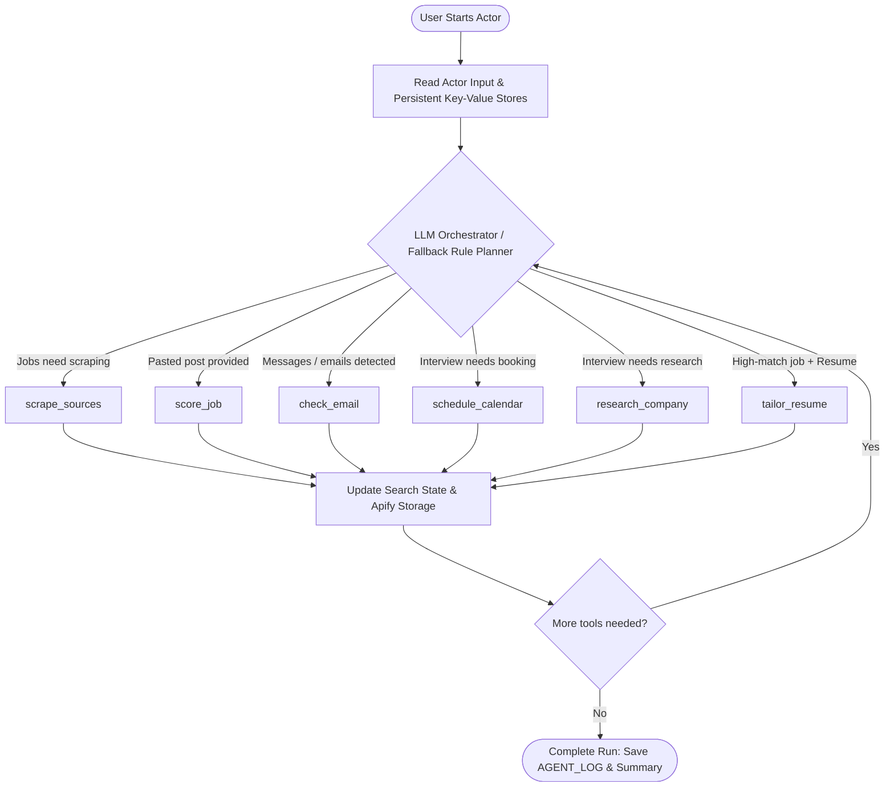

# 🛡️ GigRadar — AI Job-Search Agent for Nigeria

> **GigRadar isn't a job scraper. It's an autonomous AI agent that decides what your job search needs next.**

Every day, thousands of Nigerians scroll WhatsApp groups, Telegram channels, and job boards hunting for real opportunities — while dodging scam postings asking for "registration fees," and applying to "remote" roles that quietly exclude anyone outside the US. GigRadar sits in that mess and does the thinking for you: it checks if a job is safe, tells you if you can actually get it, tracks every application so nothing slips through ghosting, preps you for interviews, and tailors your resume — without ever inventing experience you don't have.

---

## 🎯 The Problem

- **Scams are rampant on informal job channels.** Upfront fees, BVN requests, WhatsApp-only "recruiters" — these prey on job seekers with the least room to lose money.
- **"Remote" often isn't remote for Nigerians.** Visa, country-of-residence, and payment gateway restrictions silently block qualified applicants, and most job seekers only find out after wasting hours applying.
- **Job searching is heavily fragmented.** Finding, verifying, tracking, scheduling, preparing, and tailoring are five different jobs most people juggle manually across five different apps.

GigRadar collapses all five into **one autonomous agent**.

---

## 🧠 How It Works

An **LLM orchestrator** inspects the current state of your job search — jobs found, open applications, pending interviews without calendar entries or briefs, and whether you've provided a resume — and **decides which tool to call next**, with what arguments, until nothing more is worth doing.

### Dual-Engine Resilience

Every decision is logged to the `AGENT_LOG` key-value record, providing complete visibility into what the agent chose and why. If the configured LLM provider experiences outages or rate limits, a **deterministic rule-based planner** seamlessly takes over from the exact same state — **a run never just fails**.

---

## 🛠️ Agent Tooling System

| Tool | What It Does | Why It Matters |
|---|---|---|
| `scrape_sources` | Dynamically picks job-board categories and city pages based on your role, crawls [Jobberman](https://www.jobberman.com) and [MyJobMag](https://www.myjobmag.com), scores and filters every listing. | Discovers active, genuine Nigerian roles without manual page-by-page browsing. |
| `score_job` | Evaluates job posts you paste in from WhatsApp groups, Telegram channels, flyers, or SMS. | Exposes "interview registration fee" scams and BVN phishing before you respond. |
| `check_email` | Reads pasted messages (or Gmail via OAuth), extracts status updates, and catches ghosting. | Flags rescheduling vs rejections and reminds you when recruiters go silent. |
| `schedule_calendar` | Generates Google Calendar events with pre-interview alerts or outputs universal `.ics` calendar files. | Ensures you never miss an interview, regardless of device or timezone confusion. |
| `research_company` | Crawls the employer's official website and synthesizes an interview-prep brief. | Equips you with company background, products, leadership, and custom talking points. |
| `tailor_resume` | Rewrites your resume bullets to align with job requirements **strictly honestly**. | Zero hallucinated skills or tools; any modification that invents experience is automatically discarded. |

---

## ⚙️ Built on Apify — Not Bolted On

GigRadar is engineered specifically around Apify's serverless Actor platform:

- 🗄️ **Unified Dataset Storage** — Every processed job, tracked application, and tailored resume is pushed as a strongly-typed record (`record_type: job | application | tailoring`), exportable immediately as JSON, CSV, Excel, XML, or HTML.
- 🗃️ **Key-Value Store Persistence** — State is preserved across runs. Generated `.ics` calendar files, markdown prep briefs (`PREP_BRIEF_*.md`), tailored resume files, and the complete `AGENT_LOG` decision trail live in Apify's Key-Value store.
- ⏰ **Native Scheduling** — Set GigRadar on an Apify cron schedule (e.g., every morning at 7:00 AM Lagos time) to autonomously monitor listings, detect recruiter replies, and update your tracker.
- 💰 **Pay Per Event (PPE) Monetization** — You only pay for concrete outcomes that deliver real value (a vetted job delivered, a scam flagged, a prep brief written), not idle compute time or discarded noise.
- 🤖 **Respectful & Ethical Scraping** — Complies strictly with `robots.txt`, respects target site rate limits using Crawlee, and only interacts with publicly accessible job listings.
- 🔌 **API & Webhook First** — Call GigRadar from Next.js, mobile apps, Slack bots, Make, or Zapier using Apify's standardized REST API.

---

## 💸 How Much Does It Cost?

GigRadar operates on Apify's **Pay Per Event (PPE)** pricing model. You are only billed when the agent produces a tangible, actionable result:

| Billable Event | When It Fires | Description |
|---|---|---|
| `job_normalized` | Safe, hireable job delivered | A job passed scam filtering and Nigeria hireability checks and reached your feed. |
| `scam_flag_issued` | Suspicious post flagged | A listing was flagged as a scam with concrete diagnostic reasons provided. |
| `status_change_detected` | Pipeline status updated | An application changed state (applied, interview, rejected, or ghosted). |
| `interview_scheduled` | Calendar event booked | An interview was added to Google Calendar or saved to an `.ics` file. |
| `interview_prep_generated` | Prep brief prepared | A customized company research and interview-prep brief was generated. |
| `resume_tailored` | Resume tailored | Your resume was honestly tailored to match a specific role's criteria. |

> **Zero Waste Guarantee**: Duplicate postings, reposts, off-target roles, and messages that require no status change are **100% free**. You are never billed for scraping noise.

---

## 🚀 How to Use It

1. Enter your **Target role** (e.g., `Frontend Developer`, `Accountant`), **Location** (e.g., `Lagos, Nigeria`), and **Remote preference**.
2. (Optional) Paste in suspicious job posts from WhatsApp or Telegram, paste recruiter messages, and provide your current resume text.
3. (Optional) Provide high-level guidance in **"What should GigRadar do?"** (e.g., *"Find remote React roles and prep me for my Paystack interview next week"*).
4. Click **Start**.
5. Results land in the **Dataset** (`record_type: job | application | tailoring`); calendar files, prep briefs, tailored resumes, and the agent execution trail land in the **Key-Value Store**.

You can download the dataset in various formats including JSON, CSV, HTML, or Excel.

---

## 🔑 Setup for AI and Google Features (Optional)

GigRadar operates out of the box with zero external configuration using its built-in rule engine. For enhanced reasoning and calendar automation:

- **LLM**: Set `LLM_API_KEY` (secret), `LLM_BASE_URL`, and `LLM_MODEL`. Any OpenAI-compatible provider works — including Google AI Studio's free tier. GigRadar only calls the LLM when its rules are unsure, and caps calls per run.
- **Gmail & Calendar**: Run `node scripts/google-auth.mjs` once, then set `GOOGLE_CLIENT_ID`, `GOOGLE_CLIENT_SECRET`, and `GOOGLE_REFRESH_TOKEN` (secrets). GigRadar only requests read-only Gmail access and calendar-event creation — it never sends email on your behalf.

---

## ❓ FAQ

### Is a low scam score an absolute guarantee?
**No.** Scam-risk scores are diagnostic signals supported by concrete heuristic checks and reasoning, not legal guarantees. Never send money, cryptocurrency, or sensitive financial information (such as BVN or credit card numbers) to any employer or recruiter.

### Is my personal resume or correspondence shared?
**No.** All jobs, applications, forwarded messages, and resumes remain isolated within your personal Apify account storages. If LLM reasoning is activated, only the specific sanitized text necessary for evaluation is transmitted to your configured LLM endpoint.

### Does GigRadar send emails on my behalf?
**Never.** The Google integration is strictly limited to read-only access for identifying job-related correspondence and write access for adding interview events to your calendar.

---

## 🌍 Why This Matters

This system was built for the ground truth of job hunting in Nigeria — where a "remote" tag can be a geographic trap, a WhatsApp forward can be an advance-fee fraud, and job seekers deserve tooling that genuinely understands their constraints rather than a generic US job board clone.
